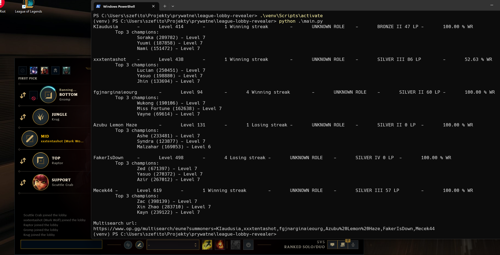
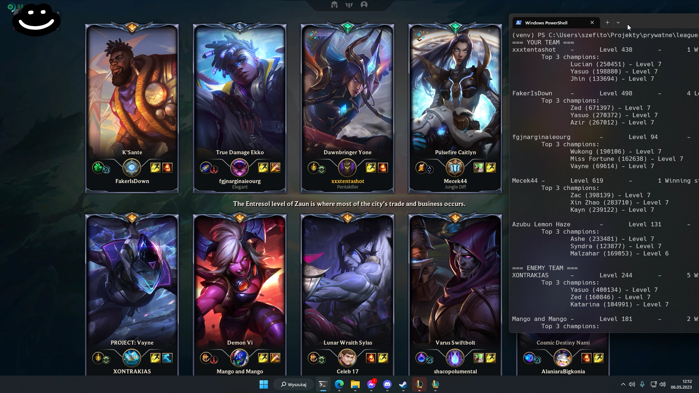

# League Lobby Revealer
CLI (for now) tool to reveal people in your ranked lobby. Written in Python 3.11, inspired by [Riotphobia/LobbyReveal](https://github.com/Riotphobia/LobbyReveal).

## Examples
<details>
<summary>In Champion Select</summary>


</details>

<details>
<summary>In Game (or in loading screen)</summary>


<sup>dont worry i inted this game hard</sup>
</details>

## Installation & Usage

1. Download Python [here](https://www.python.org/downloads/)
2. Install `poetry`

```commandline
pip install poetry
```

3. Clone this repo

```commandline
git clone https://github.com/sevnnn/League-Lobby-Revealer.git
cd League-Lobby-Revealer
```

5. Make sure that path set in `settings.ini` has correct information
6. Run the script

```commandline
poetry run python main.py
```

7. *(Optional)* If you dont want to constantly call `poetry run`, you can enter poetry shell and execute this script there

```commandline
poetry shell
> Spawning shell within...
python main.py
```

## Roadmap

In works there is a Web UI, that would make this script work and look more like a op.gg mulitsearch, when it comes to other functionalities that are in works - head to the issues tab and [filter by the `feature` label](https://github.com/sevnnn/League-Lobby-Revealer/issues?q=is%3Aopen+is%3Aissue+label%3Afeature).

## Known Issues

- When in champion select, sometimes the script will show players that you were in party with but aren't currently. Unfortunately, cant fix that.

## Contributing

If you'd like to contribute to League-Lobby-Revealer, please create [a pull request](https://github.com/sevnnn/League-Lobby-Revealer/pulls) or open [an issue](https://github.com/sevnnn/League-Lobby-Revealer/issues). 

## License

This tool is released under the MIT License. See [LICENSE](LICENSE) file for details.

<sup>rito pls no sue</sup>
